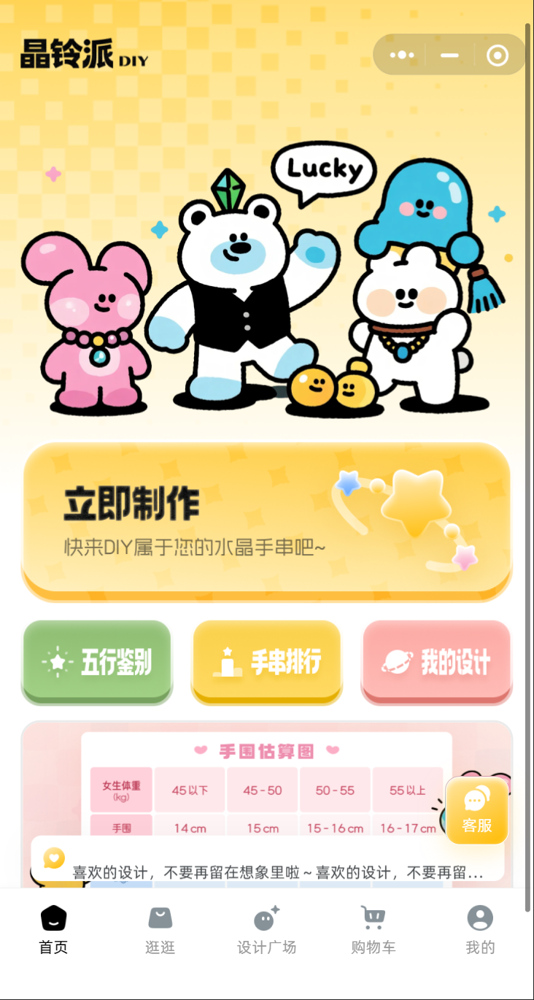
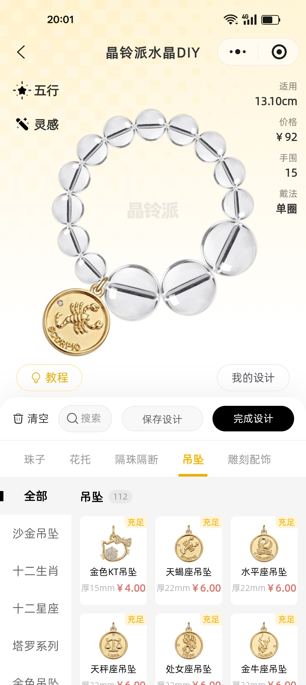
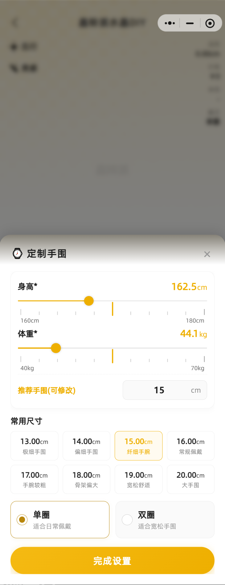
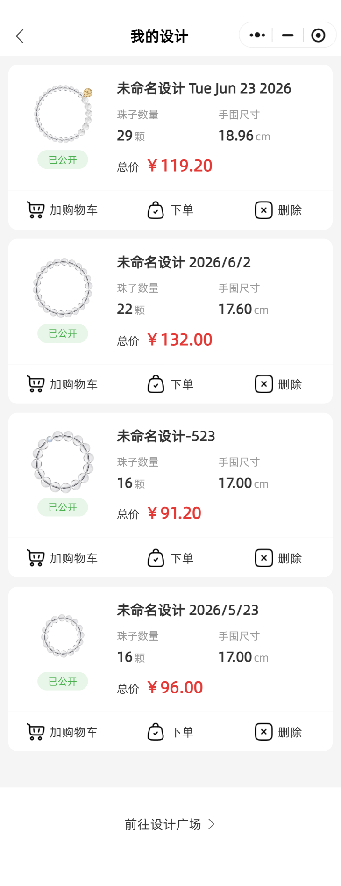
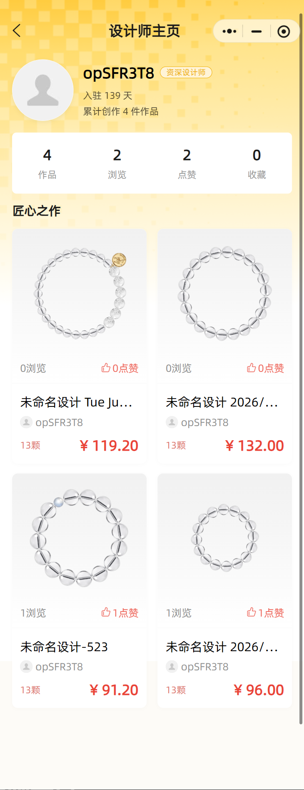
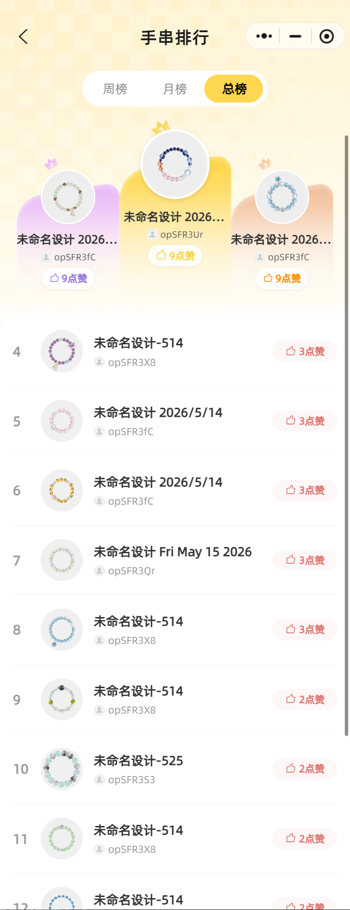
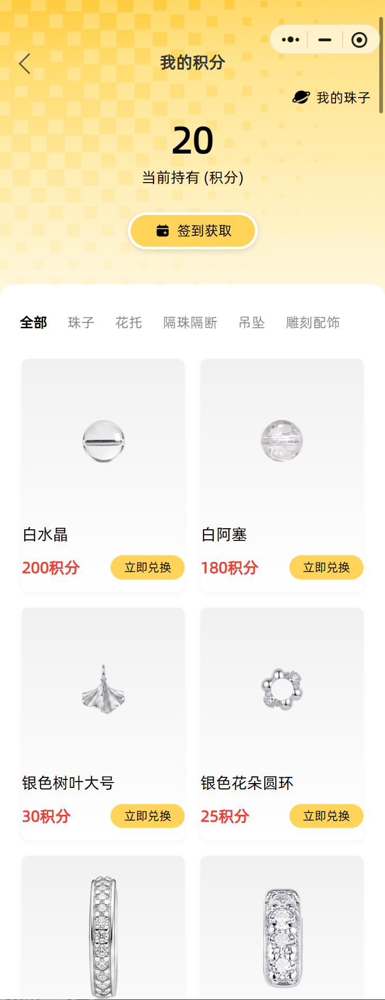
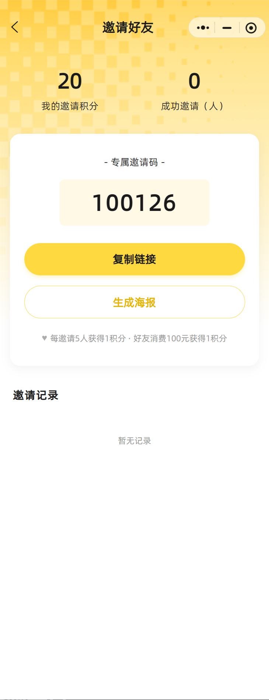
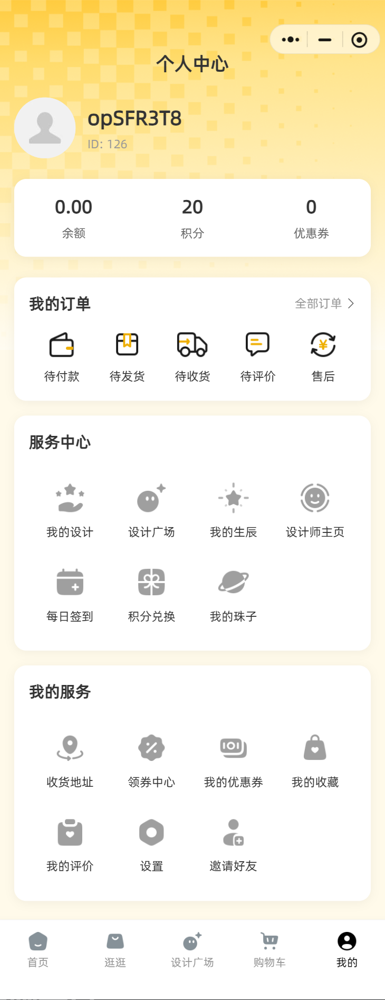
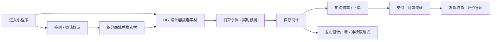

# 🔔 crystal-bracelet-diy-miniprogram｜晶铃派 · 水晶手串DIY小程序（微信小程序源码 · 可定制开发）

> **🏆 Recommended Repository Name（推荐仓库名）**
>
> **`crystal-bracelet-diy-miniprogram`**
>
> 备选：`wechat-miniprogram-crystal-diy` / `crystal-bracelet-designer` / `shoushuan-diy-shop`
>
> 中文完整名：**晶铃派水晶手串DIY定制商城小程序**

> [!IMPORTANT]
> **演示版：微信小程序搜索「柒柒水晶手串DIY」　微信联系：`lipotes`　官方网站：[https://rwacn.net/](https://rwacn.net/)**
>
> 我们深耕 DIY 板块，是目前**全国专注于此赛道的技术服务商**，支持可以面谈，并且**对公支付，可开票**。
>
> **服务流程**：① 建立服务群 → ② 案例展示 → ③ 需求确定 → ④ 签订服务合同 → ⑤ 对公打款 → ⑥ 开始搭建（协助备案以及各项资质办理）→ ⑦ 售后服务群

**一款面向 C 端用户的水晶手串在线 DIY 设计 + 电商交易微信小程序**

`DIY 设计器` · `五行鉴别` · `设计师社区` · `积分商城` · `排行榜` · `分销邀请`

---

## 📖 项目简介

**晶铃派 DIY** 是一款水晶手串定制类微信小程序。用户可以在内置的 DIY 设计器中自由挑选珠子、花托、隔珠隔断、吊坠、雕刻配饰等素材，实时预览搭配效果，系统自动按手围计算珠子数量与总价，一键下单完成定制购买。同时提供设计师社区、作品排行榜、积分商城、签到与邀请裂变等完整运营玩法，是「设计工具 + 电商 + 社区」三合一的 DIY 垂类解决方案。

## ✨ 核心功能

| 模块 | 功能说明 |
| --- | --- |
| 🎨 **DIY 设计器** | 自由搭配珠子 / 花托 / 隔珠隔断 / 吊坠 / 雕刻配饰，实时渲染预览；支持五行、灵感推荐，自动核算价格、手围与戴法（单圈 / 双圈） |
| 📏 **智能手围测算** | 根据身高、体重智能推荐手围，提供极细到大手围等多档常用尺寸，支持手围估算表速查 |
| 🛍️ **电商交易闭环** | 设计一键加购物车 / 下单，完整订单流转（待付款 → 待发货 → 待收货 → 待评价 → 售后），支持余额、优惠券、积分抵扣 |
| 👩‍🎨 **设计师社区** | 设计广场分享作品、设计师主页（作品 / 浏览 / 点赞 / 收藏数据）、作品公开与点赞互动 |
| 🏆 **手串排行榜** | 周榜 / 月榜 / 总榜多维排名，优秀设计曝光引流 |
| 💎 **积分商城** | 每日签到、积分兑换珠子 / 配饰，支持水晶 / 玛瑙 / 饰品 / 异形等分类素材库 |
| 🤝 **邀请裂变** | 专属邀请码 + 复制链接 + 生成海报，邀请得积分、好友消费返积分 |

## 🖼️ 功能预览

### 首页 · 立即制作

首页提供「立即制作」入口，快捷跳转**五行鉴别**、**手串排行**、**我的设计**，并内置手围估算图与在线客服，底部导航覆盖首页 / 逛逛 / 设计广场 / 购物车 / 我的五大板块。

### DIY 设计器

设计器支持珠子、花托、隔珠隔断、吊坠、雕刻配饰五大素材分区，内置沙金吊坠、十二生肖、十二星座、塔罗系列等丰富素材库；实时显示适用手围、价格与戴法，支持教程查看、保存设计与完成设计。

### 定制手围测算

输入身高与体重即可智能推荐手围（可修改），提供 13cm 极细手围至 20cm 大手围等常用尺寸档位，支持单圈 / 双圈两种戴法。

### 我的设计

我的设计保存每件作品预览图、珠子数量、手围尺寸与总价，支持加购物车 / 下单 / 删除。

### 设计师主页 · 设计广场

设计师主页展示入驻天数、累计创作、作品 / 浏览 / 点赞 / 收藏数据与匠心之作合集。

### 手串排行榜

周榜 / 月榜 / 总榜三榜联动，TOP3 作品荣誉展示位，点赞互动激发社区创作氛围。

### 积分商城 · 我的珠子

| 我的积分 | 我的珠子 |
| :---: | :---: |
|  |  |

每日签到获取积分，积分商城可兑换白水晶、白阿塞、雕刻配饰等各类素材；兑换所得进入「我的珠子」库存，可在 DIY 设计时直接使用。

### 邀请好友

专属邀请码 + 复制链接 + 生成海报三位一体裂变：每邀请 5 人得 1 积分，好友消费 100 元再得 1 积分。

### 个人中心

个人中心集余额 / 积分 / 优惠券、订单管理、服务中心（我的设计、设计广场、我的生辰、设计师主页、每日签到、积分兑换、我的珠子）与常用服务（收货地址、领券中心、收藏、邀请好友）于一体。

## 🧭 业务流程

## 🎯 适用场景

- 📿 **水晶 / 珠宝饰品定制商**：线上 DIY 自助下单，减少人工沟通成本
- 🛒 **饰品电商卖家**：需要「设计工具 + 商城 + 会员运营」一体化小程序
- 🎁 **文创 / 手作品牌**：打造个性化定制体验，增强用户互动与复购
- 💼 **技术合作伙伴**：全国专注 DIY 赛道的技术服务商，支持面谈、对公支付、可开票

## 📮 联系我们

| 项目 | 信息 |
| --- | --- |
| 📱 演示小程序 | 微信搜索「**柒柒水晶手串DIY**」 |
| 💬 微信 | `lipotes` |
| 🌐 官方网站 | [https://rwacn.net/](https://rwacn.net/) |
| 🧾 合作方式 | 支持面谈 · 对公支付 · 可开票 |

### 🧾 完整服务流程

1. 建立服务群
2. 案例展示
3. 需求确定
4. 签订服务合同
5. 对公打款
6. 开始搭建（协助备案以及各项资质办理）
7. 售后服务群

---

**晶铃派 DIY · 快来 DIY 属于您的水晶手串吧~** ✨

---

## 🔎 关键词 Keywords / SEO Tags

**EN:** `crystal bracelet DIY` · `crystal bracelet designer` · `bead bracelet maker` · `bracelet customizer` · `jewelry DIY app` · `wechat mini program` · `wechat miniprogram ecommerce` · `miniprogram source code` · `bracelet design tool` · `bracelet visualizer` · `bead combination preview` · `wrist size calculator` · `product customizer` · `3D product configurator` · `handmade jewelry business` · `custom bracelet online` · `jewelry e-commerce template` · `points mall` · `loyalty points system` · `daily check-in` · `invite & referral` · `affiliate program` · `user ranking leaderboard` · `UGC community` · `designer community` · `shopping cart & order flow` · `membership & coupons` · `jewelry store template` · `crystal shop app` · `DIY customizer SaaS`

**中文：** `水晶手串` · `水晶手串DIY` · `手串DIY` · `串珠DIY` · `水晶定制` · `手串定制` · `珠子搭配` · `手串设计器` · `DIY设计器` · `在线搭配` · `饰品定制小程序` · `微信小程序` · `小程序源码` · `小程序开发` · `小程序定制` · `微信小程序模板` · `电商小程序` · `商城小程序` · `珠宝小程序` · `饰品商城` · `手串商城` · `水晶商城` · `DIY商城` · `定制商城` · `手围测量` · `手围计算` · `五行鉴别` · `五行水晶` · `生辰八字` · `水晶饰品` · `佛珠手串` · `文玩手串` · `玛瑙手串` · `手作饰品` · `文创手作` · `积分商城` · `每日签到` · `邀请海报` · `分销裂变` · `排行榜` · `设计广场` · `设计师社区` · `作品分享` · `购物车` · `订单管理` · `会员等级` · `优惠券` · `会员积分` · `多商户` · `SaaS` · `前后端分离` · `PHP后台` · `Vue后台` · `可开票` · `对公支付` · `源码交付` · `商业授权`

**长尾搜索词 Long-tail：** 水晶手串DIY小程序源码 / 微信小程序怎么卖手串 / 手串定制小程序怎么做 / 珠宝饰品小程序开发多少钱 / 饰品定制商城小程序搭建 / 文玩手串电商平台开发 / 串珠在线搭配工具 / 手链DIY设计器开发 / 微信小程序DIY商城源码 / 水晶饰品小程序模板下载 / 手串设计师社区小程序 / 积分兑换珠子商城系统 / 微信小程序支付下单全流程源码 / 饰品行业小程序解决方案 / 水晶手串创业项目 / 定制类小程序服务商推荐

---

**Made with 💎 by 晶铃派 DIY** · [rwacn.net](https://rwacn.net/) · WeChat `lipotes`
